<p align="center">
  
</p>

<h1 align="center">SolarSage</h1>
<p align="center"><em>Monitor · Predict · Optimize</em></p>

<p align="center">
  Local, vendor-neutral, weather-aware solar monitoring + forecasting.
  Talks to EG4, SolarEdge, (and soon Q.Cells), stores everything in SQLite,
  overlays an Open-Meteo-driven AC + production forecast, recommends
  smart-load windows, and exposes the whole thing as a REST + MCP surface
  any LLM can query.
</p>

---

## One-liner install

**macOS / Linux**

```bash
curl -fsSL https://raw.githubusercontent.com/geekychris/solarsage/main/install.sh | bash
```

**Windows (PowerShell)**

```powershell
iwr -useb https://raw.githubusercontent.com/geekychris/solarsage/main/install.ps1 | iex
```

Then open <http://127.0.0.1:5173> and sign in with your monitoring-portal
credentials.

See [`docs/INSTALLATION.md`](docs/INSTALLATION.md) for manual install and
troubleshooting; [`docs/ARCHITECTURE.md`](docs/ARCHITECTURE.md) for how it
works inside.

## What it does

| | |
|---|---|
| **Live tiles** | Solar PV (per-string), load (main + EPS), battery SoC/V/A, grid in/out, EPS output, today/lifetime kWh. Auto-detects field names across firmware revisions. |
| **History & charts** | Range view (1d/3d/7d/14d/31d/90d + drag-to-zoom + brush), per-day chart, raw-data inspector, GitHub-style calendar heatmap. |
| **Forecasts** | Today's expected production headroom, tomorrow's hourly PV/AC/load/surplus, battery completion ETA, max-producible-now envelope. |
| **Smart load scheduler** | Given enabled appliances (water pump, washer, dishwasher, EV charger, …) recommends the best windows in the next 48h based on real surplus forecast. |
| **Multi-site, multi-vendor** | EG4 Monitor, SolarEdge (official API), Q.Cells (stub). Each site is its own location, lat/lon, capacity. |
| **AC model** | Cooling-degree regression fit from joint Open-Meteo + load history. Improves automatically as days accumulate. |
| **String health** | Flags strings producing under 60% of the strongest — catches shading, soiling, or panel issues early. |
| **Performance trend** | Actual daily kWh vs irradiance-expected. Catches gradual degradation that day-to-day variation hides. |
| **Anomaly alerts** | Background watcher fires on low SoC, daylight-but-no-PV, weak strings. Persisted, acknowledge-able. |
| **REST API** | Every panel is also a queryable endpoint. `/docs` is auto-OpenAPI. |
| **MCP server** | Same surface as native Claude / LLM tools — *"how much did I export last week?"* becomes a real tool call. |
| **Local widgets** | 35+ self-describing dashboard tiles beyond solar — tides, border wait times, marine forecast, HOA activities, tropical storms, quakes, Mexican holidays, drive-time planner, currency, air quality, and more. Auto-organized into sub-tabs (Safety / Outdoor / Travel / Solar / Community / Lists). |
| **Events + TTS reminders** | Auto-extracts events from the El Dorado Ranch HOA weekly PDF, schedules configurable reminders, speaks them through a local TTS service ("Movie Night starts in 60 minutes"). |
| **Google Sheets sync** | User-editable lists (contacts, shopping, todo, border crossings, bookmarks) live in a Google Sheets workbook — edit from any device, dashboard picks it up. |
| **Persistent news archive + translation** | RSS feed items stored in SQLite; headlines translated on-demand via MyMemory and cached forever. |
| **Threshold subscriptions** | Declarative "if X then TTS + Telegram" rules per widget. Edge-triggered, cooldown-limited, per-rule test button. |
| **MQTT + Home Assistant discovery** | Every widget publishes to your MQTT broker with an HA discovery config — sensors appear in Home Assistant automatically. |
| **Mobile / touch view** | Single-column stream + bottom tab bar + 48-px targets. Auto-detects touch devices; add to iOS home screen for a PWA-lite. |
| **Fullscreen rotation mode** | "Screensaver" cycler that walks through selected widgets full-screen with per-step dwell times. Includes a purpose-built **Solar vitals** widget (SoC, PV, load, time-to-full/empty, cut-back projection). |

## Documentation

* [`docs/INSTALLATION.md`](docs/INSTALLATION.md) — install + configuration
* [`docs/DEPLOYMENT.md`](docs/DEPLOYMENT.md) — Pi setup, systemd, apache, backups
* [`docs/ARCHITECTURE.md`](docs/ARCHITECTURE.md) — how the pieces fit together
* [`docs/WIDGETS.md`](docs/WIDGETS.md) — writing your own widget (backend + frontend renderer)
* [`docs/SHEETS.md`](docs/SHEETS.md) — Google Sheets integration setup
* [`docs/NOTIFICATIONS.md`](docs/NOTIFICATIONS.md) — subscriptions, channels, HA notify wiring
* [`docs/MQTT.md`](docs/MQTT.md) — MQTT publish + HA MQTT discovery
* [`docs/MOBILE.md`](docs/MOBILE.md) — mobile / touch layout + add-to-home-screen
* [`docs/ROTATION.md`](docs/ROTATION.md) — fullscreen rotation player + Solar vitals widget
* [`docs/API.md`](docs/API.md) — REST + MCP reference (auto-generated OpenAPI at `/docs`)

## UI walkthrough

Annotated tour of every panel. Screenshots are live captures from a real EG4
system running in San Felipe, Mexico.

### Login

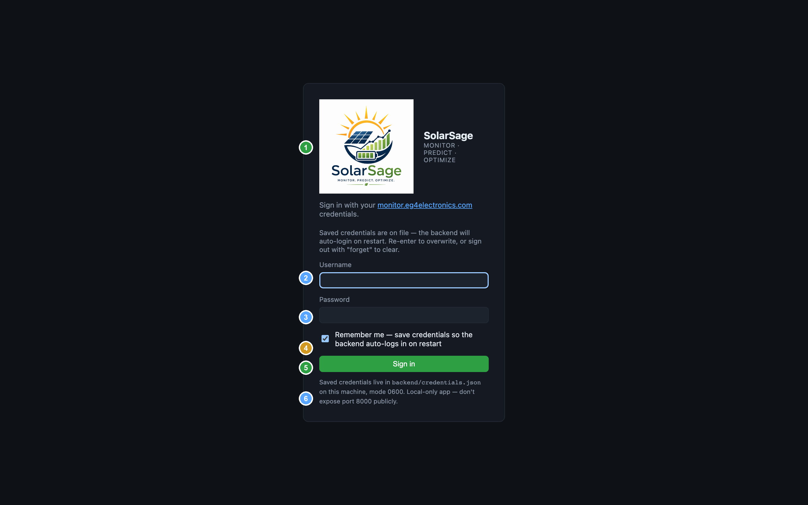

| # | What | Notes |
|---|---|---|
| **1** | Logo + tagline | App brand and the "Monitor · Predict · Optimize" promise |
| **2** | Username | Your `monitor.eg4electronics.com` login |
| **3** | Password | Stored locally only — never sent anywhere except EG4 |
| **4** | **Remember me** | Saves credentials to `backend/credentials.json` (mode 0600) so the backend auto-logs in on every restart. The UI re-acquires its session on reload without you typing anything. |
| **5** | Sign in | One-shot — checks credentials against EG4 + (if remember-me) writes the local file |
| **6** | Security disclosure | App is local-only. Don't expose port 8000 publicly. |

### Dashboard

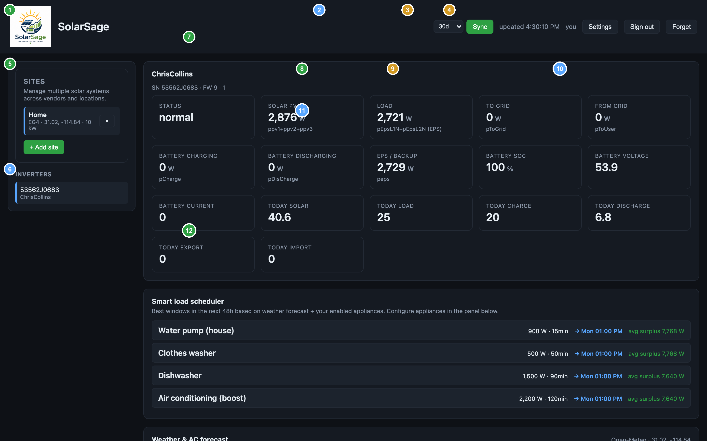

| # | What | Notes |
|---|---|---|
| **1** | **SolarSage** brand | Click to refresh the page if anything looks stale |
| **2** | Sync controls | `30d` ↔ window dropdown · **Sync** button → calls `/api/sync` to pull N days of historical data from EG4 in one click |
| **3** | Last update | When the UI last received fresh snapshot data (auto-refresh every 15s) |
| **4** | **Settings · Sign out · Forget** | Settings opens the location/capacity modal. "Forget" deletes saved credentials. |
| **5** | Sites panel | Multi-site/multi-vendor. Each row is a configured system (EG4, SolarEdge, Q.Cells). `+ Add site` opens the inline form. |
| **6** | Inverters | Auto-discovered from the selected site. Click to switch. |
| **7** | Inverter header | Plant name · serial · firmware. Anchors the live-data tiles. |
| **8** | **Solar PV** tile | Real-time PV in watts. The `ppv1+ppv2+ppv3` sub-label tells you *which* fields were summed — many EG4 firmwares only populate per-string powers, so we sum them. |
| **9** | **Load** tile | Live consumption. Sub-label shows the source field; for EPS-wired homes it pulls from `pEpsL1N+pEpsL2N (EPS)` because `consumptionPower` is zero. |
| **10** | Grid + battery tiles | To Grid / From Grid / Battery charge / discharge / EPS output / SoC / voltage / current. All field names auto-detected. |
| **11** | "Today" tiles | Today's energy totals (kWh): solar, load, charge, discharge, export, import — straight from EG4's daily counters. |
| **12** | **Smart load scheduler** | Headline feature — best 48h windows to run discretionary loads. See below. |

### Smart load scheduler

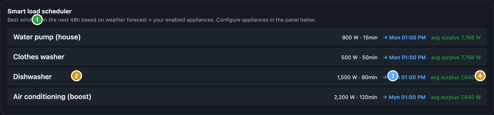

For every enabled, deferrable appliance, the scheduler scans your weather-aware
48h surplus forecast for a window where *every hour* clears the appliance's
watts — not just the average. Ranked by sustained surplus.

| # | What | Notes |
|---|---|---|
| **1** | Section title | Updates every 5 minutes |
| **2** | Appliance name | Pulled from the Appliances panel below |
| **3** | Power × runtime | What the appliance needs to run a full cycle |
| **4** | **Recommended start** | Local time. Click to copy to clipboard (in a future revision) |
| **5** | Average surplus | How much spare solar there'll be during the window — anything above the appliance's watts means zero grid/battery draw |

Real numbers from the screenshot: tomorrow ~13:00 has 7,768 W of sustained surplus,
which comfortably covers a water heater (4,500 W), washer, dishwasher, and an AC
boost — they all get the same window because the surplus is plenty.

### Weather & AC forecast

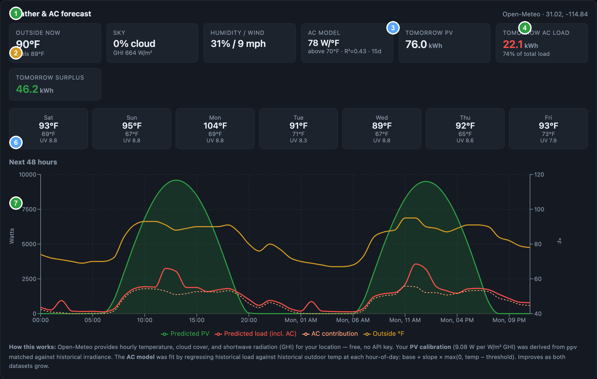

| # | What | Notes |
|---|---|---|
| **1** | Panel title | Open-Meteo source + your lat/lon |
| **2** | **Outside now** | Real temperature + apparent temp from Open-Meteo current observation |
| **3** | **AC model** | Fitted from your joint load + Open-Meteo history. `78 W/°F above 70°F, R²=0.43, 15d`: every °F above 70 outside adds ~78W to your AC load. R² rises as data accumulates. |
| **4** | **Tomorrow PV** | Predicted kWh from forecasted GHI × your system's calibration |
| **5** | **Tomorrow AC load** | The AC model applied to tomorrow's hourly temps. The "76% of total load" sub-label tells you what fraction of tomorrow's expected load is AC vs base. |
| **6** | 7-day strip | Daily high/low/UV from Open-Meteo. The 104°F day stands out — that's a heat wave coming. |
| **7** | 48-hour chart | Green area = predicted PV · red line = predicted total load (incl. AC) · orange dashed = AC contribution alone · gold line on right axis = outside °F. The AC line tracks temperature almost 1:1 — that's the cooling-degree model working. |

### Production headroom & excess

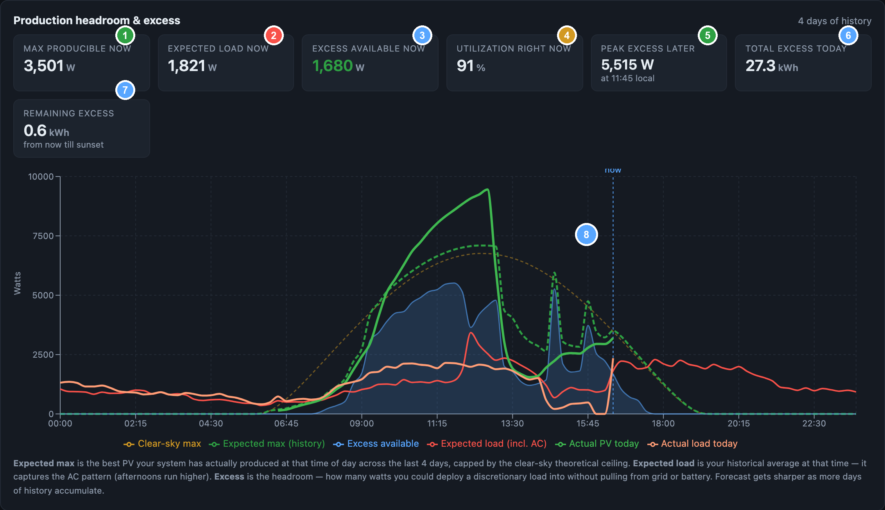

| # | What | Notes |
|---|---|---|
| **1** | **Max producible now** | Best PV your system has actually produced at this time-of-day in the last 14 days, capped by clear-sky theoretical |
| **2** | **Expected load now** | Historical avg load at this hour (captures AC time-of-day pattern) |
| **3** | **Excess available now** | The headroom — how many watts you could deploy a discretionary load into without grid/battery |
| **4** | **Utilization right now** | Today's actual PV ÷ expected max. If this is 60%, you're probably under cloud or shade. |
| **5** | **Peak excess later** | When and how much surplus is coming. Use to time discretionary loads manually. |
| **6** | **Total excess today** | All the headroom you have through end-of-day, in kWh |
| **7** | Remaining excess | Same as 6, but only counting from now → sunset |
| **8** | Chart | Clear-sky envelope (dashed orange) · expected-max (dashed bold green) · excess (blue filled area) · expected load (red) · today's actual PV (solid bright green) · today's actual load (orange). Dashed vertical line marks "now". |

### Range view

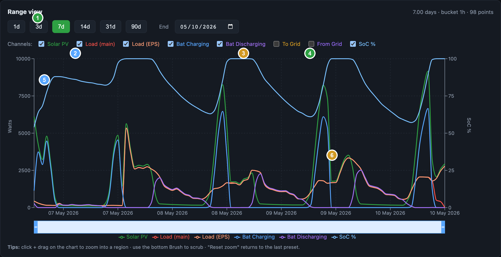

| # | What | Notes |
|---|---|---|
| **1** | Title | Shows current span + auto-bucket size + point count |
| **2** | **Presets** | `1d` `3d` `7d` `14d` `31d` `90d` — anchored to "now" |
| **3** | End-date picker | Snap the window's end to a specific date; current span preserved |
| **4** | Reset zoom | Returns to the last preset after a custom drag-zoom |
| **5** | Channel toggles | Show/hide individual series (Solar / Load main / Load EPS / battery charge / discharge / grid / SoC). Defaults to "useful for most installs". |
| **6** | **Drag-to-zoom** | Click + drag horizontally → the highlighted region becomes the new window. Re-queries at finer bucket resolution automatically. |
| **7** | Brush bar | Scrub a sub-range within the loaded data — no network call, just changes the visible window |

The bucket size auto-snaps: 1d → 5min, 7d → 1h, 90d → 6h. Always lands around
~500 points per series.

### Appliances configuration

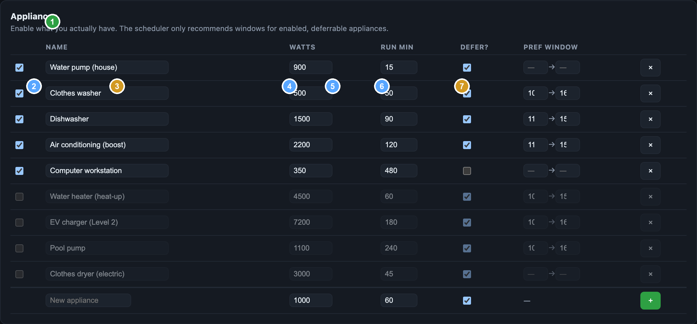

| # | What | Notes |
|---|---|---|
| **1** | Panel title | Per-site list |
| **2** | **Enable toggle** | Disabled rows are skipped by the scheduler |
| **3** | Name | Editable inline |
| **4** | Watts | Typical draw while running |
| **5** | Run min | How long one cycle lasts |
| **6** | Defer? | If unchecked (e.g. computer workstations), the scheduler won't suggest a window — these run when they run |
| **7** | Pref window | Optional `start_hour → end_hour` to limit recommendations (e.g. dishwasher 11→15) |
| **8** | + add new row | Custom appliances on top of the seeded catalog |

Default seeded catalog matches a typical North American install with pool pump
and electric dryer **disabled by default** (you mentioned you don't have those).

### Other panels (unannotated)

**Sites panel** — manage multi-vendor, multi-location systems. Each site is its
own lat/lon/capacity/credentials.

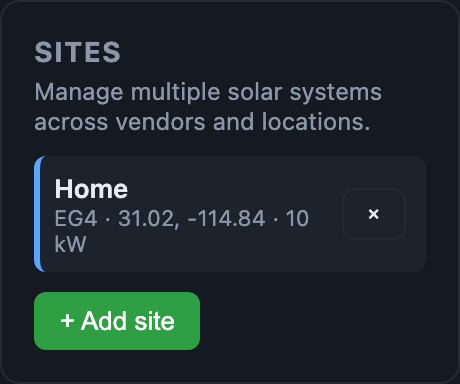

**Heatmap** — GitHub-contributions-style yearly grid. One cell per day, shaded
by daily kWh. Toggle `30d/90d/365d` window.

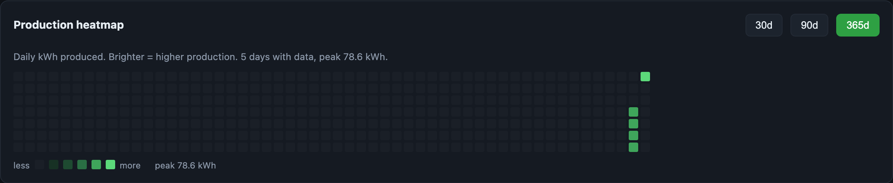

**System health** — per-string PV balance + actual-vs-irradiance-expected
performance trend. The warning banner fires when a string runs below 30% of
the strongest one. (In the screenshot, **ppv3 = 0% consistently** — that's a
real issue worth investigating: unused channel, panel/fuse fault, or shading.)

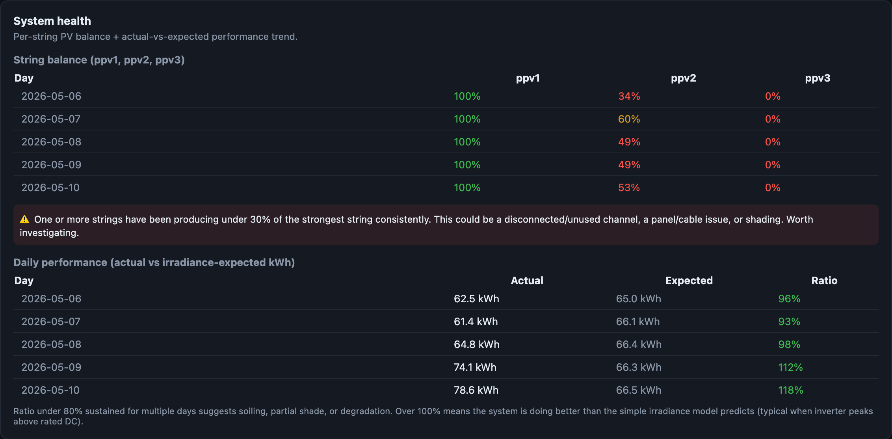

**Alerts** — anomaly watcher records low-SoC, daylight-but-no-PV, and weak-string
events. Each alert is dismissable; rules deduplicate to one fire per hour per
rule per site.

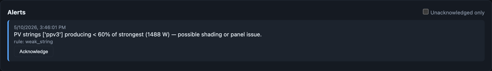

**Settings modal** — system-level config: lat/lon (DST-aware tz), peak DC kW,
battery capacity, max charge rate, historical-curve window size. All forecasts
use these.

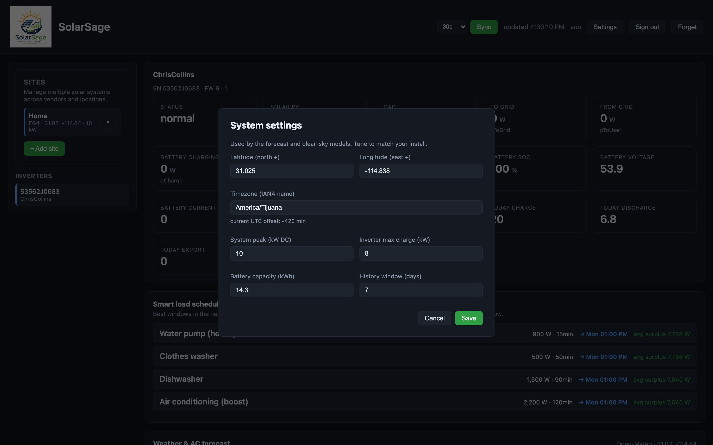

**Battery charge forecast** — projected SoC trajectory and 100% ETA based on
the historical solar curve + measured charge rate.

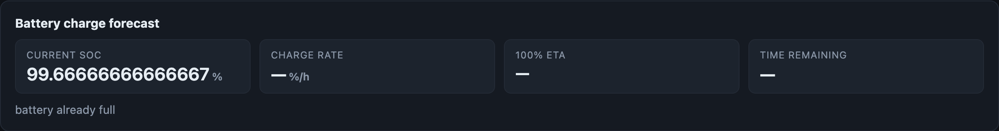

**Raw data inspector** — every field EG4 returned in the last snapshot,
split by category. Use this when a tile shows `—` to find the actual field
name on your firmware.

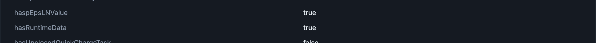

---

## How it works

A FastAPI backend talks to the solar portals on your behalf, polls every
60 seconds, stores numeric fields into SQLite, and overlays forecast +
analytics on top. A small React (Vite) frontend renders it all. Everything
runs on `127.0.0.1` — no cloud component.

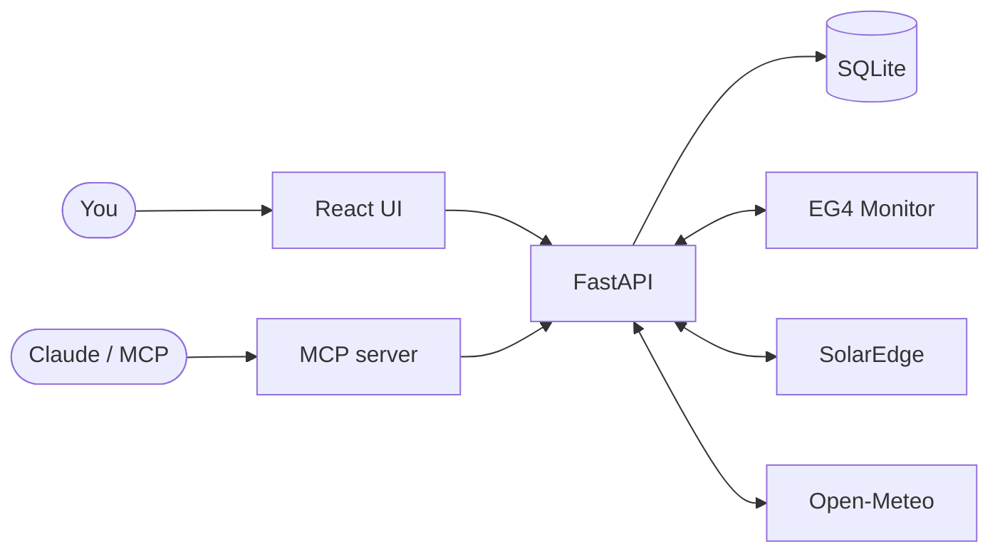

Read the full architecture doc: [`docs/ARCHITECTURE.md`](docs/ARCHITECTURE.md).

## Why a "local" app

* Your credentials never leave your machine — they sit in
  `backend/credentials.json` mode 0600.
* No telemetry, no analytics, no signup.
* You own the SQLite file. Years of high-resolution telemetry, queryable with
  plain SQL or via the REST/MCP API.
* If a portal changes, you can fix it. The whole codebase is ~3000 lines.

## Status / roadmap

| Feature | Status |
|---|---|
| EG4 live + history + backfill | ✅ shipping |
| Open-Meteo weather forecast + AC model | ✅ shipping |
| Multi-site data model + adapter pattern | ✅ shipping |
| SolarEdge adapter | ✅ shipping (paste API key in UI) |
| Q.Cells adapter | 🟡 stub — tell us your portal |
| Smart load scheduler | ✅ shipping |
| Anomaly alerts | ✅ shipping |
| Calendar heatmap, string health, perf trend | ✅ shipping |
| Mobile-responsive | ✅ shipping |
| CSV export | ✅ shipping |
| MCP server | ✅ shipping |
| Native notifications (browser, email) | 🟡 planned — backend rules already fire |
| Compare-days overlay | 🟡 planned |
| Cost-savings tracker w/ tariff input | 🟡 planned |

## License & contributing

MIT. Contributions welcome — adapter PRs for additional vendors are
especially valued. See [`docs/ARCHITECTURE.md`](docs/ARCHITECTURE.md#5-multi-site-adapter-pattern)
for the contract; a new vendor is usually 80–120 lines.

## Acknowledgements

* [`eg4-inverter-api`](https://pypi.org/project/eg4-inverter-api/) by
  Garreth Jeremiah — the EG4 live-data client we wrap.
* [`joyfulhouse/pylxpweb`](https://github.com/joyfulhouse/pylxpweb) — the
  reverse-engineered EG4 chart-endpoint catalog.
* [Open-Meteo](https://open-meteo.com/) — free, keyless weather + solar
  irradiance forecasts. Generous to a fault.
