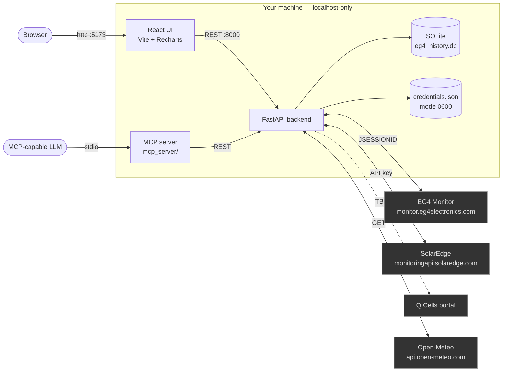
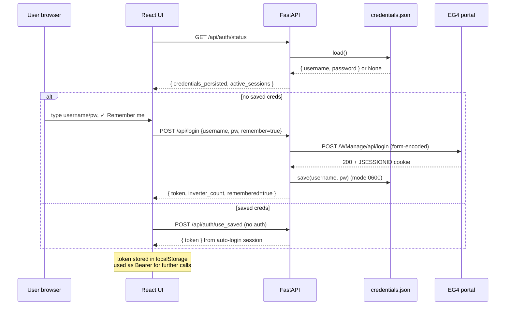
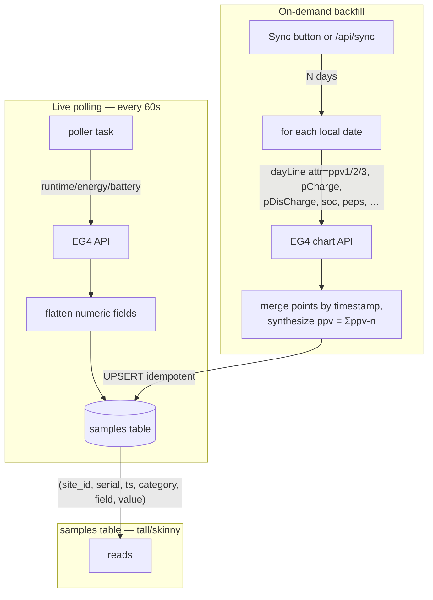
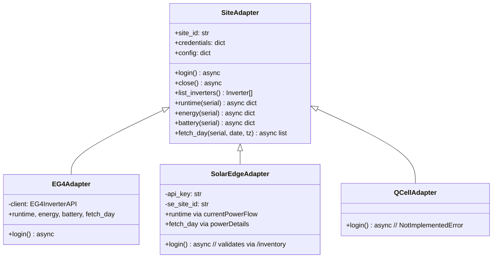
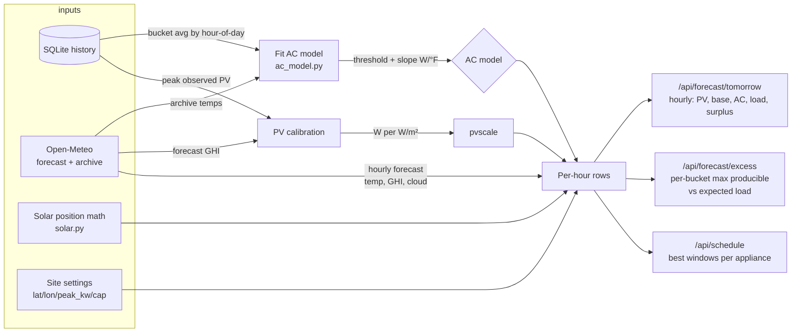
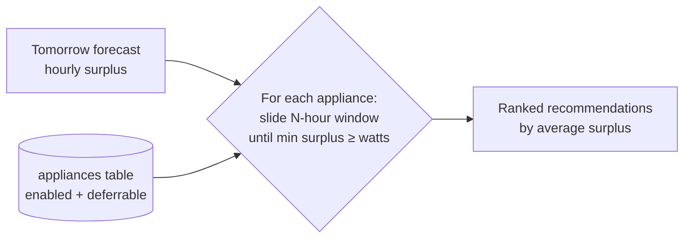
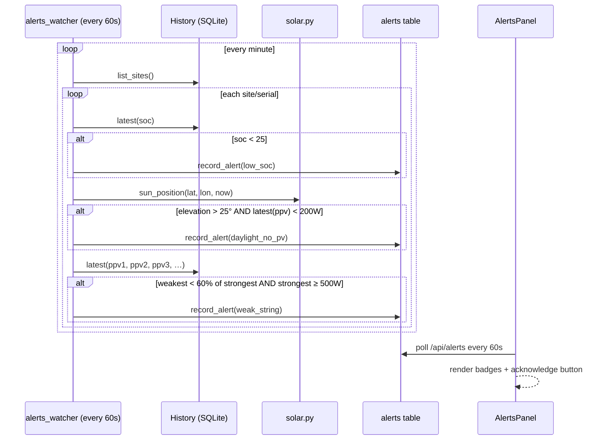

# SolarSage architecture

SolarSage is a small two-tier app — a FastAPI backend and a React frontend —
that talks to one or more solar-monitoring portals, stores everything in
SQLite, and overlays forecast / scheduling / health analytics on top. This
document explains the pieces and how data flows between them.

## 1. System overview



Everything except the four external services runs on your machine on
`127.0.0.1`. The backend listens only on loopback by default; nothing is
exposed to the LAN unless you intentionally change `--host`.

## 2. Repo layout

```
solarsage/
├── backend/
│   ├── app/
│   │   ├── main.py                FastAPI app, all endpoints, lifespan
│   │   ├── storage.py             SQLite schema + queries
│   │   ├── session_store.py       In-memory bearer/site session registry
│   │   ├── credentials.py         Local credentials.json read/write/clear
│   │   ├── adapters/              Vendor-agnostic monitoring portal clients
│   │   │   ├── base.py            SiteAdapter ABC + Inverter dataclass
│   │   │   ├── eg4.py             Wraps eg4-inverter-api
│   │   │   ├── solaredge.py       Official monitoringapi.solaredge.com
│   │   │   └── qcell.py           Stub (awaiting portal confirmation)
│   │   ├── eg4_history.py         EG4 chart endpoints (dayLine etc.)
│   │   ├── poller.py              Background snapshot loop
│   │   ├── alerts_watcher.py      Background anomaly engine
│   │   ├── forecast.py            Today/excess/battery-completion model
│   │   ├── ac_model.py            Cooling-degree regression for AC load
│   │   ├── solar.py               NOAA solar position + clear-sky envelope
│   │   ├── weather.py             Open-Meteo client
│   │   ├── scheduler.py           Smart appliance window picker
│   │   ├── appliances_catalog.py  Default appliance catalog
│   │   └── schemas.py             Pydantic request/response models
│   ├── requirements.txt
│   ├── .env.example
│   └── .env                       (gitignored — your local config)
├── frontend/
│   ├── src/
│   │   ├── App.jsx                Routing + boot auth recovery
│   │   ├── api.js                 Typed-ish REST wrapper
│   │   ├── components/            One file per panel (~15 components)
│   │   └── styles.css
│   ├── public/solarsage.png
│   ├── vite.config.js
│   └── package.json
├── mcp_server/
│   ├── server.py                  FastMCP wrapper around the REST API
│   └── README.md
├── docs/                          You're here
├── install.sh / install.ps1       One-shot installers
├── start.sh / start.ps1           Run both servers
└── solar_sage.png                 App logo
```

## 3. Boot + auth flow



On startup the backend's lifespan kicks off an `_auto_login_loop` task that
reads saved credentials and keeps a session + poller alive forever, re-auth'ing
on failure. The UI never holds your password; it's only in
`backend/credentials.json` (chmod 600, gitignored).

## 4. Live polling + historical backfill



The schema is **tall/skinny** — every numeric field becomes its own row. This
lets us add new metrics from new firmware revisions without migrations, and
makes per-field aggregation trivial (`SELECT AVG(value) ... WHERE field=?`).

Backfill uses EG4's per-attribute `dayLine` chart endpoint because the
"all-channels" `dayMultiLineParallel` endpoint returns empty on SNA-US
firmware. We issue ~30 parallel calls per day and merge by timestamp. The
chart endpoint's `time` string is preferred over `year`/`month`/`day`/`hour`
because EG4's month field is **Java zero-indexed** (May = 4).

## 5. Multi-site adapter pattern



A `sites` row carries vendor + credentials JSON + config JSON. The factory in
`adapters/__init__.py` dispatches by vendor. The rest of the app talks only
to the ABC.

## 6. Forecast pipeline



The AC model is intentionally simple:

`load(hour, °F)  =  base(hour)  +  slope_W_per_°F · max(0, °F − threshold)`

We fit `threshold` and `slope` by grid-search + OLS on residuals against
Open-Meteo's *historical* hourly temperature for the same time range as the
stored load samples. With 15 days of joint data this typically lands around
R² 0.4–0.5; it sharpens as more days accumulate.

PV calibration is even simpler: ratio of *observed peak PV* to *forecast peak
GHI*, expressed as **watts of system output per watt-per-m² of irradiance**.
Real number from a 15kW EG4 system at low-desert latitudes: ~9 W per W/m².

## 7. Smart load scheduler



`schedule_appliances()` only suggests windows where *every* hour in the
window clears the appliance's draw — not just the average. That prevents
"the dishwasher tries to start during a cloud passage" cases.

Appliances flagged `can_defer=false` (e.g. computer workstations) are
skipped — they run when they run, not on a schedule. Preferred-hour windows
(`preferred_start_hour`, `preferred_end_hour`) narrow further if set.

## 8. Anomaly alerts



Each rule has **1-hour suppression** so a sustained problem fires once per
hour, not every minute.

## 9. REST surface

The full surface is auto-documented at <http://127.0.0.1:8000/docs>. Highlights:

| Category | Endpoints |
| --- | --- |
| Auth | `POST /api/login`, `POST /api/logout`, `GET /api/auth/status`, `POST /api/auth/use_saved` |
| Live | `GET /api/runtime`, `/api/energy`, `/api/battery`, `/api/snapshot` |
| History | `GET /api/history`, `/api/range`, `/api/daychart`, `/api/coverage`, `/api/metrics` |
| Analytics | `GET /api/aggregate`, `/api/summary`, `/api/best_day`, `/api/heatmap`, `/api/string_health`, `/api/performance` |
| Sync | `POST /api/sync`, `/api/backfill`, `GET /api/diagnostic`, `POST /api/debug/eg4` |
| Forecast | `GET /api/forecast/{tomorrow,excess,solar_today,battery_completion,max_production}`, `/api/weather`, `/api/schedule` |
| Multi-site | `GET/POST /api/sites`, `DELETE /api/sites/{id}`, `GET/POST /api/appliances`, `DELETE /api/appliances/{id}` |
| Alerts | `GET /api/alerts`, `POST /api/alerts/{id}/ack` |
| Settings | `GET/PUT /api/settings` |
| Export | `GET /api/export.csv` |

**Two auth modes**: `Authorization: Bearer <token>` (UI flow) **or**
`X-API-Key: <env-configured key>` (scripts, MCP, curl). Endpoints that only
read SQLite accept either; endpoints that talk to the EG4 portal require a
live session.

## 10. Where data lives

| Thing | Where | Notes |
| --- | --- | --- |
| All time-series samples | `backend/eg4_history.db` (SQLite) | One file. Back this up. |
| Sites + appliances + alerts | same SQLite | |
| Active EG4/SolarEdge session | in-process memory | Re-established on backend restart from saved creds |
| Saved credentials | `backend/credentials.json` | mode 0600, gitignored |
| App config (lat/lon/peak kW) | `settings` table in SQLite | Editable via UI |
| Local env overrides | `backend/.env` | TLS bypass, DB path, etc. — gitignored |
| Frontend assets | served by Vite dev server (`:5173`) or built into `frontend/dist/` | |

A clean reset is: stop both servers, delete `backend/eg4_history.db` and
`backend/credentials.json`, and start over.
